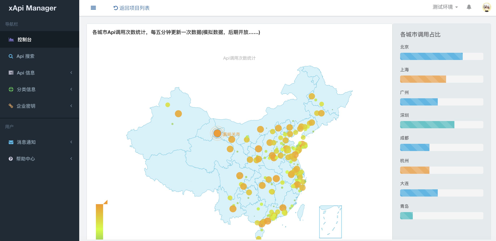
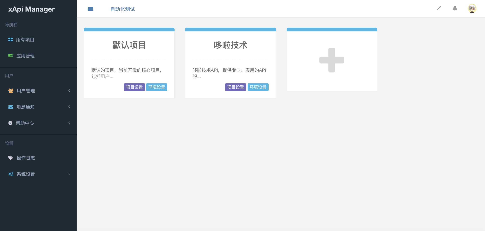

项目介绍
========
### xApi Manager-哆啦接口管理平台
XAPI MANAGER -专业实用的开源接口管理平台，为程序开发者提供一个灵活，方便，快捷的API管理工具，让API管理变的更加清晰、明朗

基于golang开发的V3版本已上线

- 官方地址：[https://xapi.smaty.net/](http://)
- 项目部署及配置：[https://shuka.smaty.net/t/xapimanager](http://) (安装和升级请参考手册)
- 书咖网-开源图书社区: [https://shuka.smaty.net](http://)
- 二进制安装包: [https://github.com/duolatech/xApi-Manager](http://)

golang 版本特点

1. 支持多团队、多项目、多环境，带给你更多的方便
2. 支持完整的权限管理，功能权限（菜单权限，节点权限）、数据权限（项目权限，分类权限）
3. 优化Api管理、request、response数据多层级导入及展示
4. 简化操作、增加易用性、让体验更优
5. 线上版本，打开即用，无需部署及配置，为了保证您的数据安全，我们进行了多重保护
6. 开源版本，简化安装，无需其他辅助软件，直接运行

本次更新特别感谢小组成员程欢处理了多处问题，感谢知名系统架构师徐总反馈了很多问题及修改建议。我们将继续努力，提供更好的产品。

### v3源码地址

* 码云地址：https://git.oschina.net/duolatech/xapimanager
* github地址：https://github.com/duolatech/xapimanager

项目介绍
========
**控制台** 

**多项目支持** 

**Api列表** 

最后
========
非常欢迎大家贡献代码，让这个项目成长的更好。
