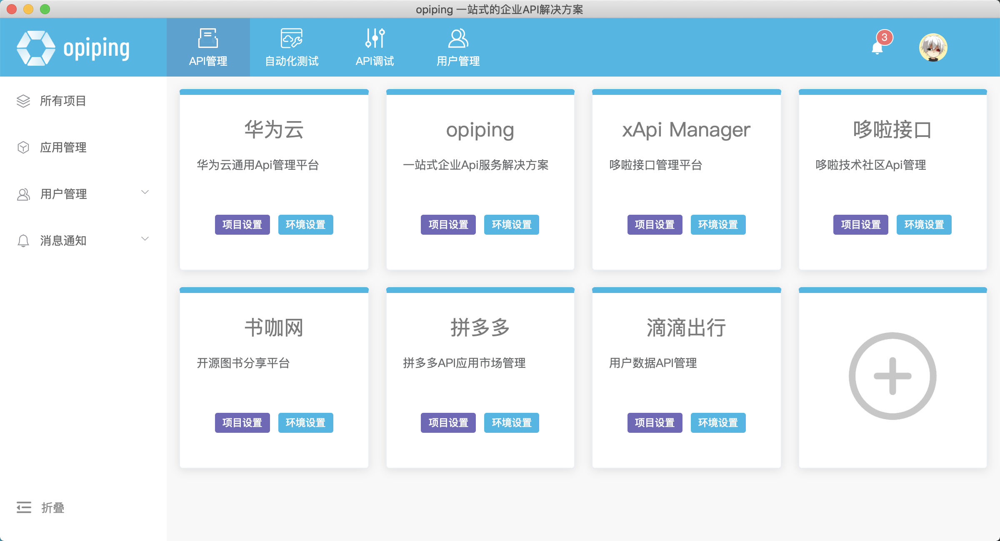
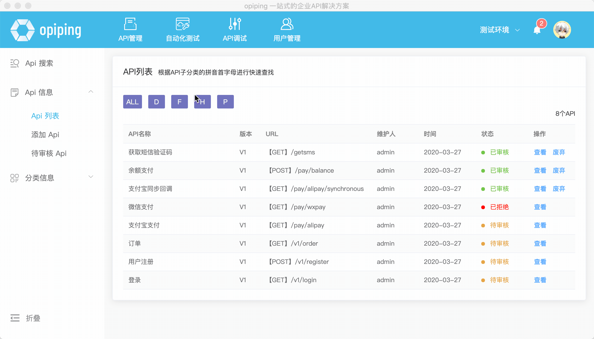
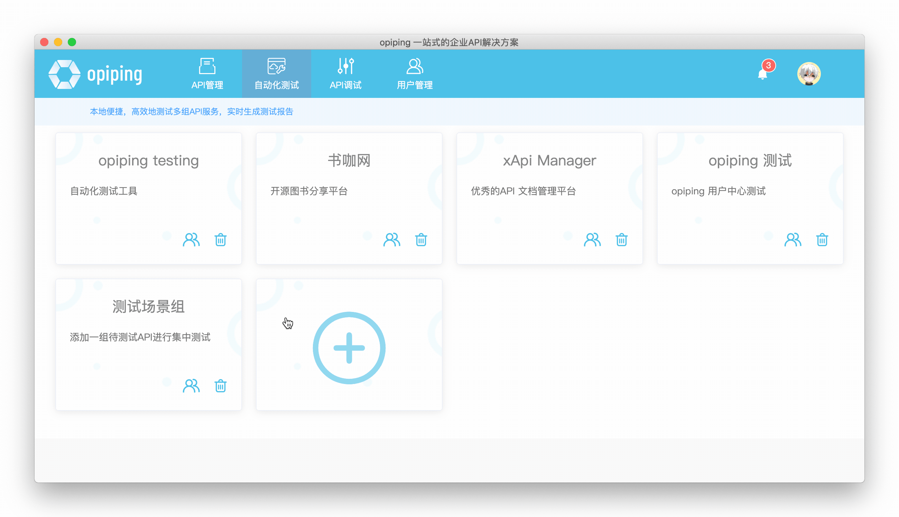
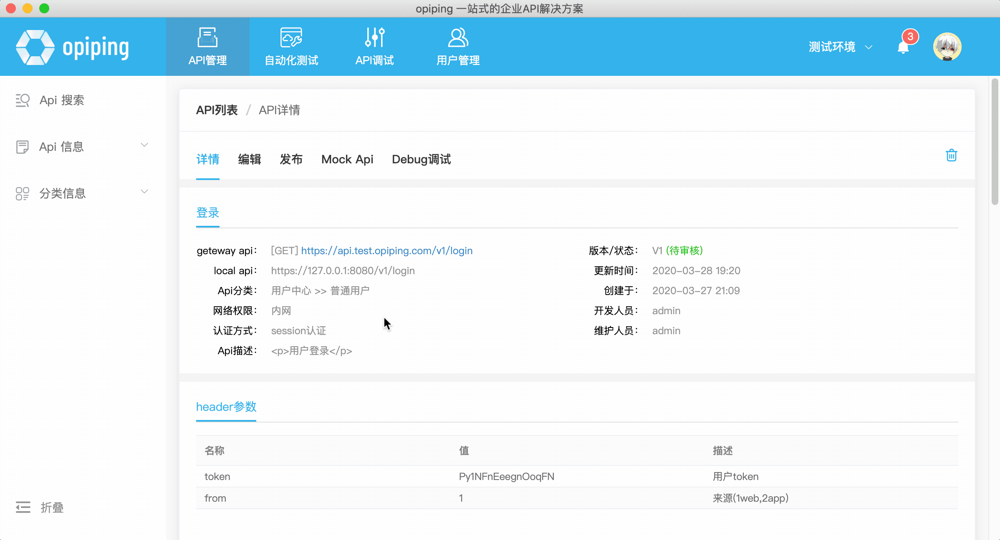
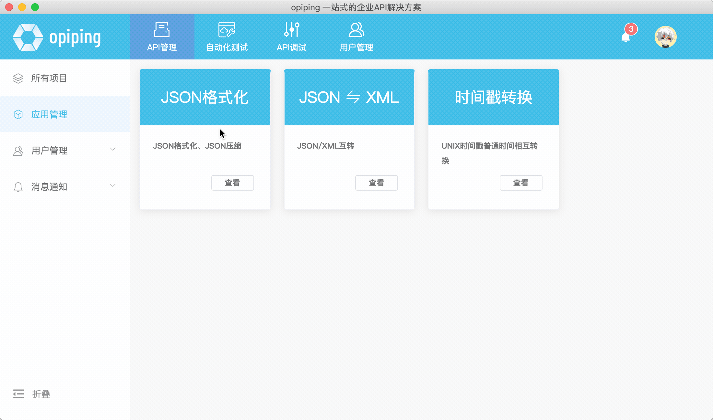
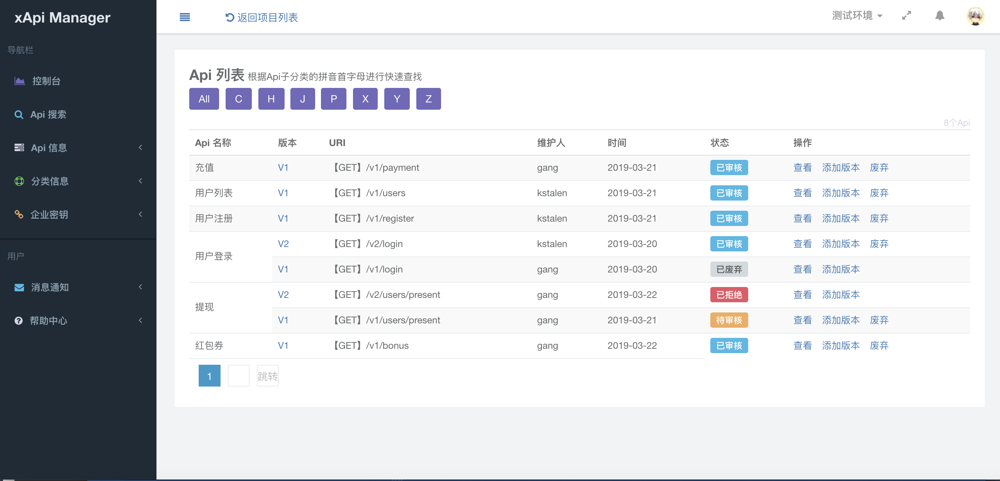

项目介绍
========
### xApi Manager-哆啦接口管理平台
XAPI MANAGER -专业实用的开源接口管理平台，为程序开发者提供一个灵活，方便，快捷的API管理工具，让API管理变的更加清晰、明朗。欢迎大家加入QQ交流群(623709829)，共同探讨一些技术问题、交流一些想法

功能说明
1. 支持多团队、多项目、多环境，更符合技术开发和使用场景
2. 支持Api场景组并发测试、性能测试
3. 通过功能权限、数据权限让您精准的控制用户的使用权限，使其尽在掌控之中
4. 动态生成API数据，让前后端更好的协同开发，降低等待时间，提高开发效率

- 官方地址：https://xapimanager.opiping.com/
- 项目部署及配置：https://shuka.opiping.com/t/xapimanager (安装和升级请参考手册)
- Windows、Mac、Ubuntu、Deepin 客户端下载: https://www.opiping.com/

### v3源码地址

* 码云地址：https://git.oschina.net/duolatech/xapimanager
* github地址：https://github.com/duolatech/xapimanager

Windows、Mac、Ubuntu、Deepin客户端
========
**多团队管理** 

**Api快速查找** 

**Api自动化测试** 

**Api Mock测试** 

**常用插件** 

golang 版本特点

1. 支持多项目、多环境，带给你更多的方便
2. 支持完整的权限管理限）
3. 优化Api管理、request、response数据多层级导入及展示
4. 简化操作、增加易用性、让体验更优

========
**Api列表** 

最后
========
非常欢迎大家贡献代码，让这个项目成长的更好。
