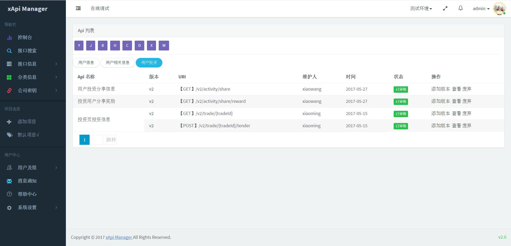
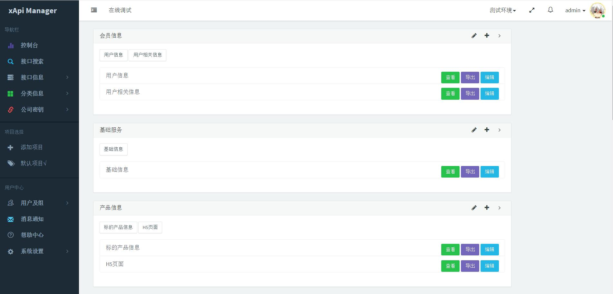
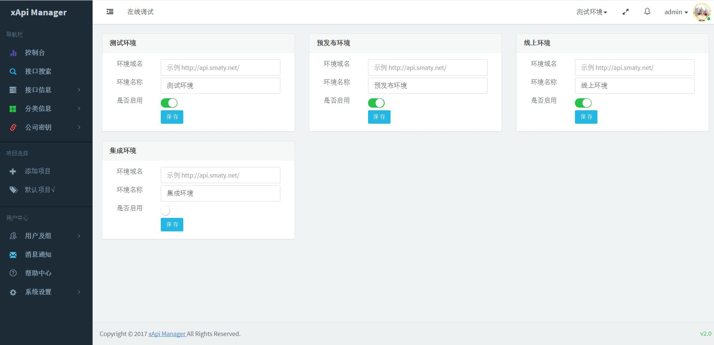
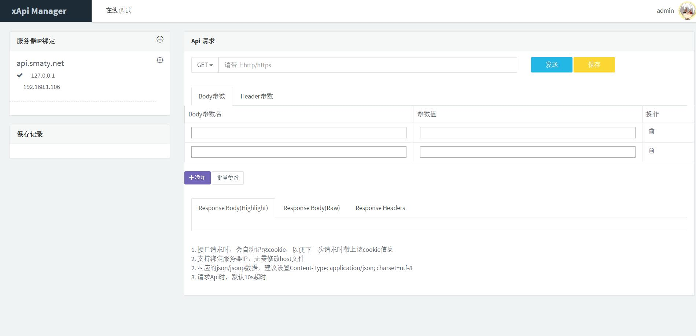

项目介绍
========
### xApi Manager-哆啦接口管理平台
XAPI MANAGER -专业实用的开源接口管理平台，为程序开发者提供一个灵活，方便，快捷的API管理工具，让API管理变的更加清晰、明朗
### 特点
* 全站基于 Laravel 5.4  + Bootstrap + jQuery +layer3.0开发
* 开放源代码，开发者可以根据自己的需求自由使用和定制
* 让开发者更加专注于项目业务和逻辑的实现，及协同开发
* 支持多项目、多环境管理，支持消息通知及帮助中心

### v2.2 版本更新说明

1. 优化项目及切换功能
2. 新增api列表全部查询功能
3. 修复环境变量设置
4. 修复创建项目后权限不足导致的添加接口报错问题
5. 修复在线调试时支持ip+端口模式
6. 修复之前版本升级预留的其他问题

本次更新特别感谢小组成员程欢处理了多处问题，感谢知名系统架构师徐总反馈了很多问题及修改建议。我们将继续努力，提供更好的产品。

### v2版本说明

v2版本进行了一次大的重构，支持了多项目多环境、企业密钥等若干改进和优化，欢迎大家下载使用，如果您在使用中遇到什么问题请及时向我们反馈。同时欢迎大家加入QQ交流群(623709829)，共同探讨一些技术问题、交流一些想法。

* 官方地址：http://xapi.smaty.net/ （admin/admin123）
* 项目部署及配置：http://www.smaty.net/t/xapi-manager (安装和升级请参考手册)
* 开源图书社区: http://www.smaty.net

我们的愿景是做最好的接口管理平台，如果您感兴趣，欢迎加入我们的开发团队

* 码云地址：https://git.oschina.net/duolatech/xapimanager
* github地址：https://github.com/duolatech/xApi-Manager

项目介绍
========
**控制台** 

**多项目设置** 

**Api列表** 

**Api分类** 

**Api环境设置** 

**Api调试**

最后
========
非常欢迎大家贡献代码，让这个项目成长的更好。
