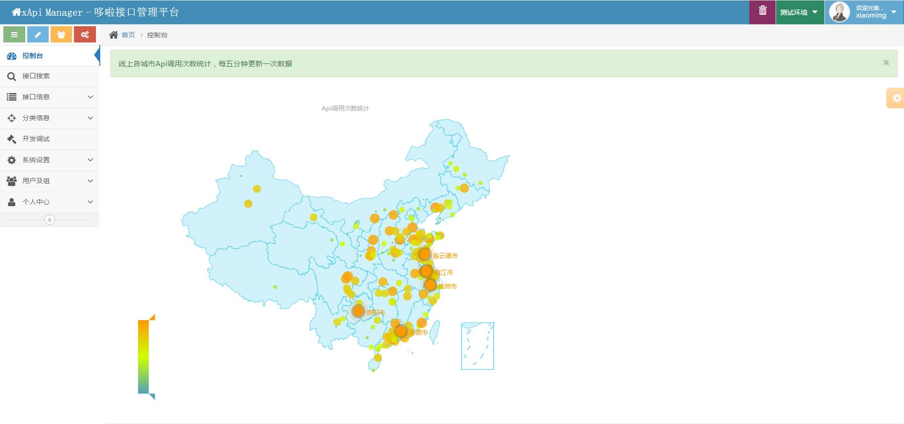
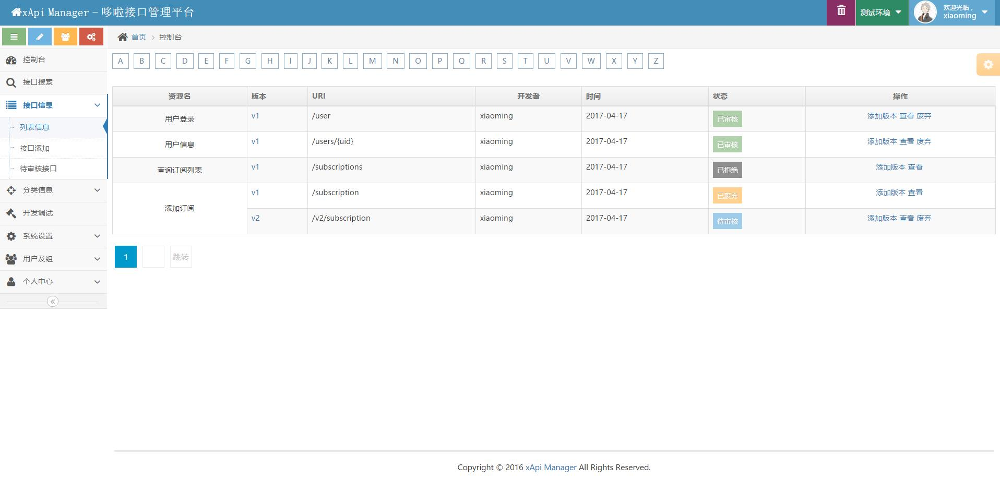
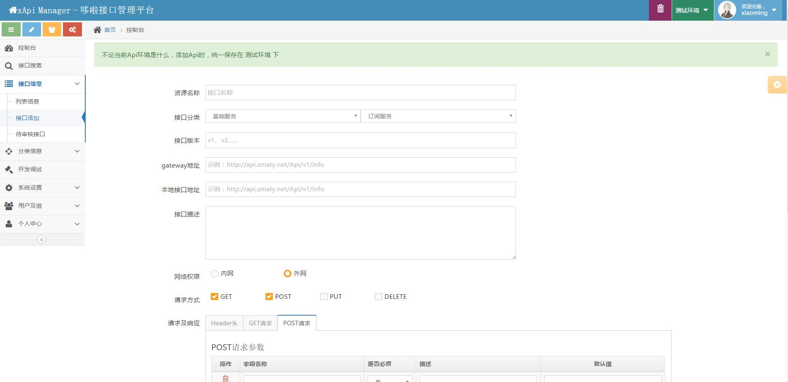
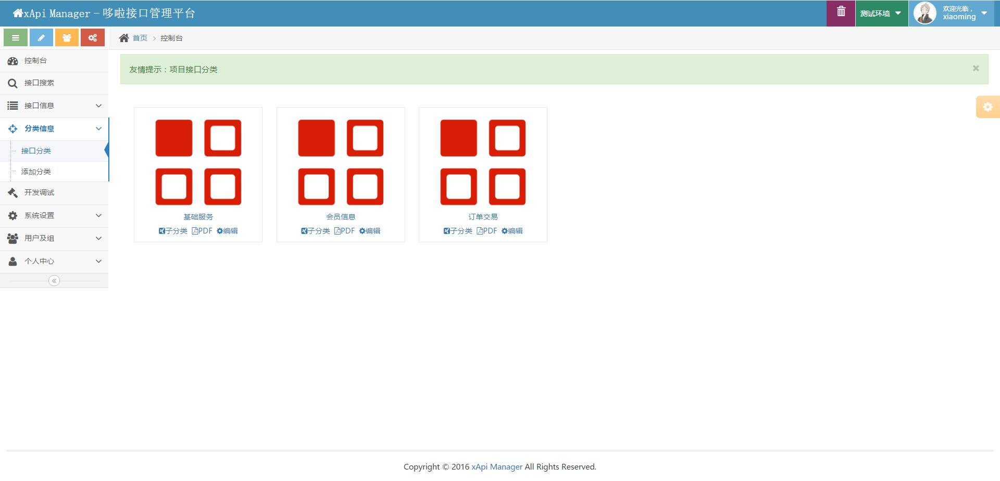
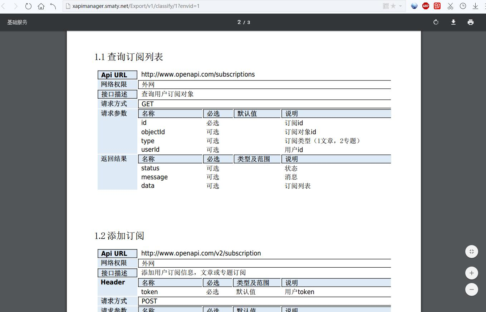

项目介绍
========
### xApi Manager-哆啦接口管理平台
XAPI MANAGER -专业实用的开源接口管理平台，为程序开发者提供一个灵活，方便，快捷的API管理工具，让API管理变的更加清晰、明朗
### 特点
* 全站基于 Laravel 5.4 + Ace Admin + Bootstrap + jQuery +layer3.0开发
* 开放源代码，开发者可以根据自己的需求自由使用和定制
* 让开发者更加专注于项目业务和逻辑的实现，及协同开发
* 根据Api接口分类，灵活导出分类Api文档，便于开发人员阅读开发
### v1.1版本说明
1. 完善对php多个版本的支持，推荐在php5.6、php7.0、php7.1下使用
2. 升级pdf导出类，支持php5.6以上版本
2. 优化了创建子分类时，自动关联上级分类
3. 修复了面包栏显示和链接跳转
4. 修复分类跳转、保存及缓存清理
5. 修复用户管理分页及查询错误
6. 优化代码结构，并去除多余字体

项目介绍
========
### 使用说明
* 体验地址(账号：admin/admin123)：http://xapi.smaty.net
* 项目部署及配置：http://www.smaty.net/t/xapi-manager
* 社区讨论：http://www.smaty.net/t/xapi-manager
* QQ交流群
### 项目截图

最后
========
非常欢迎大家贡献代码，让这个项目成长的更好。
